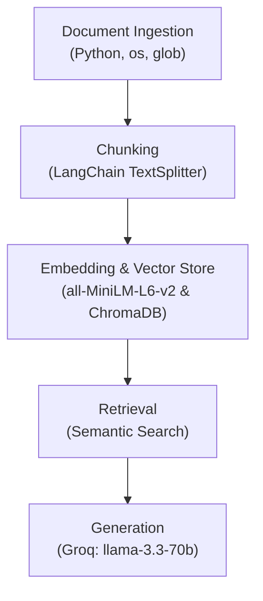

# Project 1 Planning: The Unofficial Guide

> Write this document before you write any pipeline code.
> Your spec and architecture diagram are what you'll use to direct AI tools (Claude, Copilot, etc.) to generate your implementation — the more specific they are, the more useful the generated code will be.
> Update the Retrieval Approach and Chunking Strategy sections if you change your approach during implementation.
> Update this file before starting any stretch features.

---

## Domain

<!-- What domain did you choose? Why is this knowledge valuable and hard to find through official channels? -->
The domain I choose is campus community. Information about the campus community is crucial because it dictates a student's actual day-to-day college experience and sense of belonging. Some of the information is hard to find because official university resources like admission wesites are designed for marketing and administration. These resources are lack of unfiltered, real-time, peer-to-peer insights.

---

## Documents

<!-- List your specific sources: URLs, subreddit names, forum threads, or file descriptions.
     Aim for at least 10 sources that together cover different subtopics or perspectives within your domain. -->

| # | Source | Description | URL or location |
|---|--------|-------------|-----------------|
| 1 |Reddit|First Year Housing Tier List |https://www.reddit.com/r/RPI/comments/1ap0cuk/first_year_housing/ |
| 2 |Reddit|Prospective Student Q&A |https://www.reddit.com/r/RPI/comments/1qevhdr/prospective_student/ |
| 3 |Reddit |Clubs recommanded |https://www.reddit.com/r/RPI/comments/cp98ps/what_clubsgroups_official_and_not_should_i_check/|
| 4 | Reddit|Social life opinions|https://www.reddit.com/r/RPI/comments/1ayi1im/social_life_is_it_really_that_bad/ |
| 5 |Reddit|On-campus gender inclusive housing |https://www.reddit.com/r/RPI/comments/1coxkbd/gender_inclusive_housing/ |
| 6 |Reddit|Accessing supercomputer resources |https://www.reddit.com/r/RPI/comments/28ds30/accessing_supercomputer_resources/|
| 7 |Reddit |Study spot recommandations for both on campus and off campus |https://www.reddit.com/r/RPI/comments/cf25ul/study_spots_onoff_campus/ |
| 8 |Reddit|Useful websites for better campus experience |https://www.reddit.com/r/RPI/comments/1n1wdpg/sites_you_need_to_know_about_as_an_incoming/ |
| 9 |Reddit|Incoming Freshman Packing List  |https://www.reddit.com/r/RPI/comments/uierkf/incoming_freshman_packing_list/ |
| 10 |Reddit |Dorm Room necessities |https://www.reddit.com/r/RPI/comments/v0cwth/dorm_room_necessities/ |

---

## Chunking Strategy

<!-- How will you split documents into chunks?
     State your chunk size (in tokens or characters), overlap size, and explain why those
     numbers fit the structure of your documents.
     A review-heavy corpus warrants different chunking than a long FAQ. -->

**Chunk size:** ~300 to 500 characters

**Overlap:** ~50 to 100 characters

**Reasoning:** Reddit comments and review-style texts are incredibly dense. If someone reviews a dorm, they might mention the AC, the bathrooms, and the social vibe all in 400 characters. There're also some long reviews with 3-4 paragraphs. The overlap ensures the LLM know what do some paragraphs refer to. 

---

## Retrieval Approach

<!-- Which embedding model are you using (e.g., all-MiniLM-L6-v2 via sentence-transformers)?
     How many chunks will you retrieve per query (top-k)?
     If you were deploying this for real users and cost wasn't a constraint, what tradeoffs
     would you weigh in choosing a different embedding model — context length, multilingual
     support, accuracy on domain-specific text, latency? -->

**Embedding model:** I will use all-MiniLM-L6-v2 via sentence-transformers. This is a lightweight, highly efficient model that runs locally.

**Top-k:** I plan to set top-k = 5

**Production tradeoff reflection:** If cost wasn't a constraint, I'll collect as many data as I could and use a commercial API model to weigh upgrade. The large language model is able to capture more slang and informal internet speech accurately. While an API model might offer better accuracy, it introduces network latency and requires sending student-generated data to a third-party server. The local MiniLM model guarantees zero network latency and complete data privacy.

---

## Evaluation Plan

<!-- List your 5 test questions with their expected correct answers.
     Questions should be specific enough that you can judge whether the system's response
     is right or wrong. "What are good dining halls?" is too vague.
     "What do students say about wait times at [dining hall name] during lunch?" is testable. -->

| # | Question | Expected answer |
|---|----------|-----------------|
| 1 |What do students say about VCC North and VCC South? |It is pretty chill places to work in. |
| 2 |Does RPI have supercomputer cluster? |RPI has a bunch of supercomputer clusters. |
| 3 |What do people say about the Fall rush for Greek life? | Fall rush is now only open to sophomores and higher.|
| 4 |What do students say about the website QUACS|It's a godsend for picking classes |
| 5 |What do students say about the space in Sharp dorm? | It's 101 sq ft.|

---

## Anticipated Challenges

<!-- What could go wrong? Name at least two specific risks with reasoning.
     Consider: noisy or inconsistent documents, missing source attribution, off-topic
     retrieval, chunks that split key information across boundaries. -->

1. Because I am pulling from Reddit threads where students write conversationally, a reviewer might name the specific dorm in their very first sentence, and then write three subsequent paragraphs detailing their experience. Even with recursive chunking and overlap, there is a risk that the chunk containing the actual substantive review gets separated from the chunk containing the subject's name.

2. Because I am using a lightweight, locally hosted embedding model (all-MiniLM-L6-v2), it may struggle to properly weigh these domain-specific terms compared to standard English vocabulary. This creates a risk of off-topic retrieval.

---

## Architecture

<!-- Draw a diagram of your pipeline showing the five stages:
     Document Ingestion → Chunking → Embedding + Vector Store → Retrieval → Generation
     Label each stage with the tool or library you're using.
     You can use ASCII art, a Mermaid diagram, or embed a sketch as an image.
     You'll use this diagram as context when prompting AI tools to implement each stage. -->
     
## Architecture

---

## AI Tool Plan

<!-- For each part of the pipeline below, describe:
     - Which AI tool you plan to use (Claude, Copilot, ChatGPT, etc.)
     - What you'll give it as input (which sections of this planning.md, which requirements)
     - What you expect it to produce
     - How you'll verify the output matches your spec

     "I'll use AI to help me code" is not a plan.
     "I'll give Claude my Chunking Strategy section and ask it to implement chunk_text()
     with my specified chunk size and overlap" is a plan. -->

**Milestone 3 — Ingestion and chunking:**

**Milestone 4 — Embedding and retrieval:**

**Milestone 5 — Generation and interface:**
